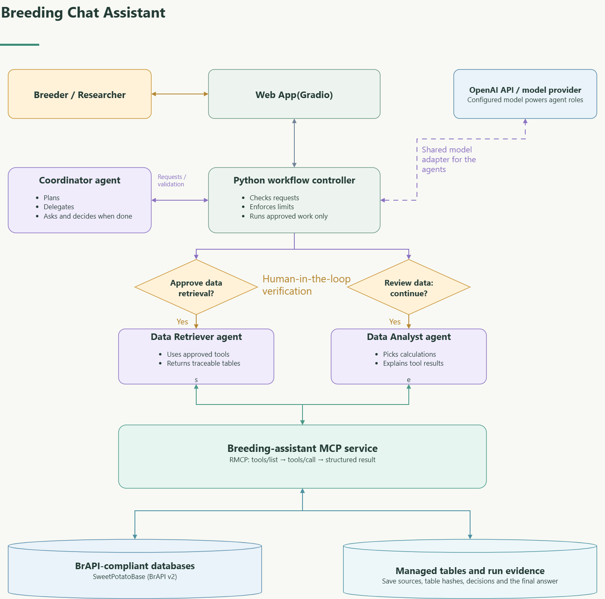

# BreedAPI Chat Agent

**Ask questions about breeding data in everyday language. Review the evidence before using the answer.**

BreedAPI Chat Agent helps breeders and agricultural engineers find studies, explore recorded traits, and summarize measurements through a chat website. The demonstration connects to public data in **SweetPotatoBase**.

The demonstration runs on **Hugging Face Spaces** and opens in your web browser. No software installation is needed.

**[Open the demonstration](https://huggingface.co/spaces/bidhanghimire/brapi-breeding-assistant)**

## What can I ask?

| What you want to know | Example question |
| --- | --- |
| Find studies from a season | “Which studies have a 2026 season?” |
| Count listed locations | “How many locations are in the catalog?” |
| Summarize a recorded trait | “In study [study name or ID], what is the mean of [exact trait name]?” |
| Check data completeness | “In study [study name or ID], how many measurements are missing for [exact trait name]?” |

Replace the text in square brackets with names from your database. Begin with **one study and one trait**. Exact names help distinguish similar studies and measurements.

The assistant provides descriptive results, such as counts, means and missing-data summaries. These can help you understand the evidence available for breeding decisions. The current version does not perform genetic evaluation or recommend which parents to cross or which lines to advance. A mean across recorded observations is not an adjusted breeding value.

## Use the assistant

1. **Ask your question.** Open the demonstration and type in the Assistant tab. Answer any clarification questions in the chat.
2. **Review the proposed request.** Check the database, study, trait and scope. Choose **Approve** when they match your question. The first question may also ask to prepare a catalog: a list of available studies and traits.
3. **Check the retrieved data.** When a preview appears, check the table names, sample rows and completeness notes. Choose **Continue to analysis** when you are satisfied. The preview is a sample, not every row.
4. **Read the result and its evidence.** Open **Full report · sources & methods** below the conversation. Check the source, units, number of observations, missing values and calculation before using the result.
5. **Record your review.** Choose **Accept** or **Reject**. Acceptance records your review; it does not certify scientific correctness. Copy the report if you want to keep it.

Choose **Cancel** to stop a pending request or **New question** to begin again. Changing to a different study or trait may require a new request and approval. A request waiting for your reply expires after 15 minutes.

The **FAQ & How to use** tab contains examples and help, including the data sharing policy.

## How it works

Three AI agent roles work together, with **human-in-the-loop verification**:

| Role | What it does |
| --- | --- |
| **Coordinator agent** | Interprets your question, proposes a plan, asks for clarification and chooses the next specialist action. |
| **Data Retriever agent** | Selects permitted tools to retrieve the approved breeding data. |
| **Data Analyst agent** | Selects supported calculations and explains their results using the retrieved evidence. |

The app uses the **Model Context Protocol (MCP)** to give the agents access to a shared set of retrieval and analysis tools. The retrieval tools connect to **BrAPI-compliant databases**. BrAPI, the Breeding API, is the common interface through which participating databases make breeding records available to software.

A workflow controller checks each proposed action and enforces your approvals and the request limits. An agent cannot grant itself permission. The shared MCP service runs within the hosted application; you do not need to host a separate service. OpenAI supplies the language model used by the agents.

Some simple catalog questions can be answered directly from the catalog. Every question does not need every agent or an analysis step.

## Data sharing and saving results

Your questions and relevant database excerpts are sent to OpenAI, sometimes before you approve a database request, and run records are saved on the hosting server. Share only information your program permits, and copy the full report for your records; starting a new question does not delete saved server records.

## Using the code

You can use and adapt this software's code as a starting point for your own breeding-data chat assistant. A new database connection needs appropriate access permission and compatibility checks, and the resulting answers should be checked against known records before use.

This software is available under the [MIT License](LICENSE). Database data and third-party libraries retain their own terms.

## Citing this project

If you use this software, its code or its outputs in research, **please cite this repository**. Include the version or commit you used so that others can identify the same software.

Suggested citation:

> Ghimire, B. (2026). *BreedAPI Chat Agent* [Computer software]. GitHub. https://github.com/Bidhan-ghimire/BreedAPI-Chat-Agent

GitHub's **Cite this repository** option provides a citation you can copy; add the release or commit used in your study.

Also cite the original breeding database and datasets according to their citation requirements. Citing this software does not replace crediting the people who generated the data.
